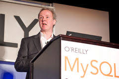
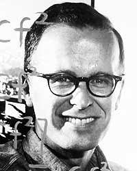

# Pertemuan 1

## Soal 

1. cari tahu 10 tokoh komputer beserta penemuannya dengan deskripsinya. Contoh:
	>**Allan Turing**: Penemu _turing machine_ yang menjadi dasar cara kerja komputer yang di buat awalnya untuk memecahkan kode _enigma_.
	
	dari statement diatas, didapat 2 kata yang asing. yaitu _enigma_ dan _turing machine_.
	berikutnya pahami dan jabarkan apa dari kata tersebut. contoh:

	> 	**enigma**: alat yang dipakai jerman untuk berkomunikasi rahasia di militer saat perang dunia 2. 	
	> **turing machine**: alat ciptaan Alan Turing yang menjadi pondasi komputer saat ini.
2. Pelajari sejarah komputer sampai ke akarnya. Mulai dari beberapa keyword berikut:
	- Radix (cth: binary, decimal, hexadecimal )
	- beda bit byte gigabit kilobyte dst.., hubungannya dengan Metric prefix dan standarisasinya.
	- logic gates
	
	Tuliskan apa yang kamu ketahui  pada masing masing keyword diatas. Tuliskanlah! 
	Dan cari 3 istilah yang menurutmu asing dan definisikan sendiri.
	
_**Keterangan:**_
- Semua tulisan lingkupnya hanya yang berhubungan dengan metematika, logika, algoritma, komputer, teknik dan elektronik. 

- beserta fotonya 

## Jawaban

1. 10 Tokoh sejarah komputer dan pemrograman
    
    - **Ulf Michael Widenius** : pencipta My Structured Query Language  (MySQL) database server (1979)

        
      
        > _MySQL_ : software sistem manajemen basis data
    
    - **Dennis Ritchie** : pencipta bahasa pemrograman C (1972) dan pencipta sistem operasi UNIX (1970-an)

          

        > _C language_ : diciptakan untuk memprogram sistem dan jaringan komputer serta untuk mengembangkan software aplikasi.

        > _UNIX_ : sistem operasi komputer yg diawali oleh project multics (multiplexed information and computing services) tahun 1965. UNIX bersifat multitasking, multiuser dan portable.
    
    - **Bjarne Stroustrup** : pencipta bahasa pemrograman C++ (1980) yang merupakan pengembangan dari bahasa pemrograman .

        

        > _C++_ : pengembangan bahasa pemrograman C. dengan kelebihan fitur object oriented programming (OOP).

        > _OOP_ : metode pemrograman yang berorientasi terhadap objek dengan tujuan mempermudah pengembangan program dengan model yang sudah ada.
    
    - **Linus Torvalds** : perintis pengembang kernel Linux (1991) yang berasal dari sistem operasi unix dan minix.

        

        > _Kernel_ : penghubung antara software dan hardware.

        > _Linux_ : pengembangan sistem operasi unix dan minix namun bersifat modular.

        > _Minix_ : pengembangan sistem operasi unix yang ditujukan untuk penggunaan akademis (Andrew S. Tanenbaum - 1987).

    - **James Gosling** : pencipta bahasa pemrograman java dalam sebuah project bernama The Green Project saat masih bergabung dengan Sun Microsystem yang saat ini merupakan bagian dari Oracle.

        

        > _Java_ : bahasa pemrograman yang dapat dijalankan berbagai komputer dan telepon genggam.

        > _Sun Microsystem_ : produsen semikonduktor dan perangkat lunak yang bermarkas di silicon valley, california.

    - **Anders Hejlsberg** : Pencipta C#, turbo pascal dan microsoft.NET (.NET Framework).
        

        > _C#_ : C sharp, merupakan bahasa pemrograman multi-paradigma atau OOP.

        > _Turbo pascal_ : sistem pengembangan perangkat lunak yang terdiri atas kompiler dan integrated development environment.

        > _Microsoft.NET_ : perangkat lunak dengan perangkat kerja yang berjalan pada sistem operasi microsoft windows.

    - **Ken Thompson** : Pencipta bahasa pemrograman B, Salah satu pencipta Unix dan bahasa pemrograman Bon.

        
    
        > _B languange_ : (1969) bahasa pemrograman yg menjadi cikal-bakal bahasa pemrograman C.
        
        > _Bon Language_ : bahasa pemrograman yang bekerja pada sistem operasi MULTICS.
    
    - **Guido van Rossum** : pencipta bahasa pemrograman python.

        

        > _Python language_ : bahasa pemrograman interpretatif multiguna yg berfokus pada tingkat pembacaan kode.
       
        > _Pemrograman interpretatif_ : penerjemahan pemrograman yang berarti :  
         - mengeksekusi sumber kode secara langsung,
         - menerjemahkan ke dalam p-code,
         - mengeksekusi kompilasi kode pada kompiler. 
    
    - **Tim Berners Lee** : pencipta world wide web (www) berkat berhasil menghubungkan hypertext transfer protocol (HTTP) client dengan server menggunakan jaringan komputer (1989).
        
		
        
		> _WWW_ : satu ruang informasi yang digunakan secara global. www merupakan web browser dan web editor pertama.
       
        > _HTTP_ : protokol jaringan lapisan aplikasi yg digunakan untuk sistem informasi terdistribusi, kolaboratif, dan menggunakan hypermedia.

    - **John Backus** : pencipta bahasa pemrograman FORTRAN.

        

        > _FORTRAN_ : merupakan singkatan dari formula translation. Digunakan dalam 50 tahun terkahir sebagai pembuatan aplikasi matematika, ilmu pengetahuan dan teknik.

2. Pelajari sejarah komputer sampai ke akarnya. Mulai dari beberapa keyword berikut:

	- Radix (cth: binary, decimal, hexadecimal)
        > **_Radix_** : istilah untuk menggambarkan jumlah digit yang digunakan dalam sistem angka posisi sebelum pindah ke tempat digit berikutnya. Misalnya, dalam sistem angka 10 basis, ada total 10 digit yang digunakan (nol hingga sembilan), oleh karena itu, radix-nya adalah 10. Dalam sistem angka 2 basis, ada dua angka yang digunakan (nol dan satu), jadi radix-nya dua. Kata lain yang identik dengan radix adalah basis dan root, dalam arti aritmatika.
        
        > **_Binary_** : Binary adalah sistem angka 2 basis yang ditemukan oleh Gottfried Leibniz yang hanya terdiri dari dua angka: 0 dan 1. Sistem angka ini adalah dasar untuk semua kode biner, yang digunakan untuk menulis data seperti instruksi prosesor komputer yang digunakan setiap hari
        
        > **_Decimal_** : Basis 10 angka, 0 - 9. Pertama kali digunakan oleh bangsa china pada tahun 1350 SM.
        
        > **_Hexadecimal_** : Sistem penomoran kombinasi 16 digit karakter untuk mewakili satu angka.
	
    
    - beda bit byte gigabit kilobyte dst.., hubungannya dengan Metric prefix dan standarisasinya.

        >
            | satuan        | persamaan     |
            | ------------- |:-------------:|
            | byte          | 8 bit         |
            | kilobyte      | 1024 byte     |
            | megabyte      | 1024 kilobyte |
            | gigabyte      | 1024 megabyte |
            | terabyte      | 1024 gigabyte |
            | pentabyte     | 1024 terabyte |

        > sistem bilangan elektronika digital (metric prefix)

            | Decimal     |  0   |  1   |  2   |  3   |  4   |  5   |  6   |  7   |  8   |  9   |  10  |  11  |  12  |  13  |  14  |  15  |
            | Binary      | 0000 | 0001 | 0010 | 0011 | 0100 | 0101 | 0110 | 0111 | 1000 | 1001 | 1010 | 1011 | 1100 | 1101 | 1110 | 1111 |
            | Octal       |  0   |  1   |  2   |  3   |  4   |  5   |  6   |  7   |  10  |  11  |  12  |  13  |  14  |  15  |  16  |  17  |
            | Hexadecimal |  0   |  1   |  2   |  3   |  4   |  5   |  6   |  7   |  8   |  9   |  A   |  B   |  C   |  D   |  E   |  F   |

	    > logic gates table
             
          | Inputs | Outputs |
          | A | B  |    AB   |
          | 0 | 0  |    0    |
          | 0 | 1  |    0    |
          | 1 | 0  |    0    |
          | 1 | 1  |    1    |
