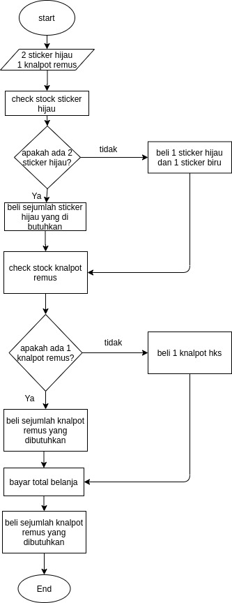

# Pertemuan 10

1. _Pseudocode_ : bentuk penulisan algoritma yang menggunakan struktur bahasa pemrograman sederhana. Pseudocode tidak mengikuti aturan penulisan bahasa pemrograman manapun. karena fungsi pseudocode hanya untuk mempermudah seseorang memahami sebuah algoritma. pseudocode hanya menyerupai kode program saja, dan tidak bisa dimengerti langsung oleh komputer. pseudocode baru bisa diolah oleh komputer jika telah mengikuti aturan penulisan sebuah bahasa pemrograman.

- contoh penulisan pseudocode :

> Menampilkan tulisan test
> Start
>   Print "test"
> End

2. _Flowchart_ : adalah suatu bagan dengan simbol tertentu yang menggambarkan ururtan proses secara mendetail dan hubungan antara suatu proses (instruksi) dengan proses lainnya dalam suatu program.

- simbol flowchart :

<input type="image" src="img/Simbol-Flowchart-1002x1024.jpg" alt="submit" > </input>

- contoh flowchart :

<input type="image" src="System-Flowchart-2.jpg" alt="submit" > </input>

## latihan

- Buatlah Pseudocode dan flowchart dari kondisi dibawah ini.

> belanja aksesoris mobil, berikut daftar belanja nya, 2 buah sticker yang berbeda warna, siapkan daftar belanja, beli juga 1 knalpot. untuk sticker harus cari ketersediaan warna, kalau penjual ada 1 warna hijau. ambil biru dan hijau. tapi kalau hijaunya ada 2 pcs, ambil kedua hijau.

> untuk knalpot kalau ada merk hks check merk remus.
kalau ada remus lebih baik ambil remus.

1. flowchart

2. Pseudocode

- start / memulai belanja
- belanja aksesoris mobil
- daftar belanja 2 buah sticker dan 1 buah knalpot.
- memilih 2 buah sticker
- jika hanya ada 1 sticker hijau maka pilih lagi 1 warna biru. jika ada 2 warna hijau maka pilih keduanya.
- memilih 1 buah knalpot
- jika terdapat merk remus, pilih merk remus. jika tidak ada merk remus pilih merk hks.
- end / checkout.

