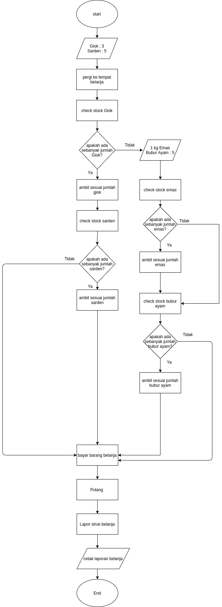

# Pertemuan 11

## Tugas in class

1. Bos saya, pak simbolon menyuruh anak buahnya mencari 3 buah giok dan 5 buah sarden. jika gioknya tidak ada boleh diganti dengan satu kilogram emas yang ada di toko emas. jika yang didapat emas, sarden diganti dengan 5 buah bubur ayam. saat kembali buatkan laporan dengan mencetak jumlah masing - masing barang. berikan laporannya ke pak simbolon.

## Homework

1. Buatlah flowchart dengan atribute subroutine.
- Pelajari kegunaan subroutine! 