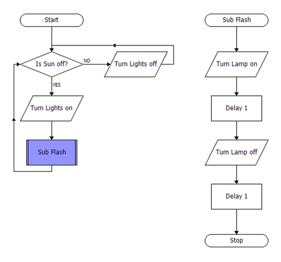
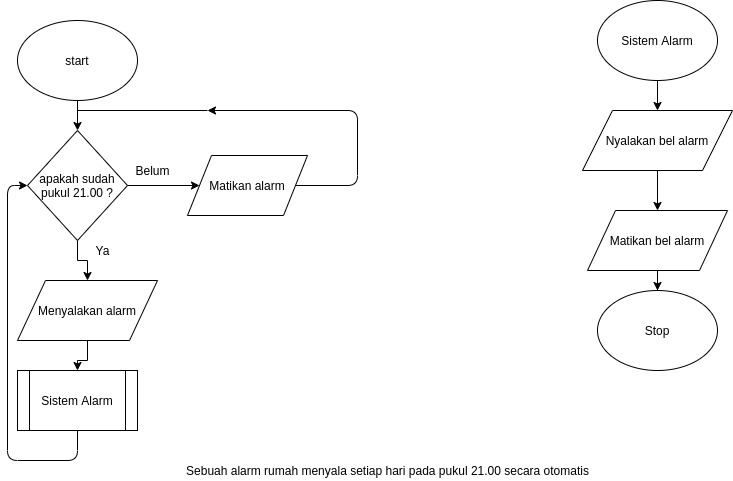

# Pertemuan 12

1. git push, git pull, git commit

2. membuat flowchart dengan atribute subroutine

- contoh :

- soal dan jawaban

## intermezzo
- git add .
- git commit -m "isi apa saja"
- git push
- _jangan menggunakan git force !_