# Pertemuan 13 (24-02-2020)

## General Knowledge of the Computer Network

1. _Computer Network_ : Jaringan dari system komunikasi data yang meilbatkan sebuah atau lebih system komputer yang dihubungkan dengan jalur transmisi alat komunikasi yang membentuk satu system. Pada akhirnya, dengan adanya network, komputer yang satu dapat menggukanan data dikomputer yang lain.

* Tipe Jaringan :
    - PAN : Personal Area Network
    - LAN : Local Area Network
    - MANs : Metropolitan Area Networks
    - WANs : Wide Area Networks

2. Cara kerja jaringan komputer : 

3. OSI Layer

# On Class Assignment

- IP Address (Internet Protocol Address) : 

1. Ip address numbering

* ex : 129.144.50.56
    - 129.144. : Network part
    - 50.56 : host part
2. Converting ip address, binary to decimal

* ex : 
    - IP address : 129.144.50.56
    - Binary : 10000001.10010000.00110010.00111000

3. IP address class type

- Class A : 1.0.0.1 to 126.255.255.254    : Supports 16 million hosts on each of 127 netwroks : for public
- Class B : 128.1.0.1 to 191.255.255.254  : Supports 65.000 hosts on each of 16.000 networks : 
- Class C : 192.0.1.1 to 223.255.254.254  : Supports 254 hosts on each of 2 million networks
- Class D : 224.0.0.0 to 239.255.255.255  : Reserved for multicast groups
- Class E : 240.0.0.0 to 254.255.255.254  : Reserved for future use, or research and development purposes. 

## Homework

The private ranges are as follows:

10.0.0.0
172.16.0.0
192.168.0.0

1. Mengapa penomoran private network seperti keterangan diatas?
2. Cari Tahu Sejarah IP.
3. Baca tentang subneting / subnetmask
4. Cari tahu merk dan jenis alat networking (list berdasarkan kategori `netgear abc01`) beserta fungsinya. termasuk jenis kabel network.
5. selain computer network, sebutkan penerapan lain dari OSI Layers model.

## Answer

1. Regulasi **IANA** 
* Point 3. Private Address Space, alinea 3.
    > "An enterprise that decides to use IP addresses out of the address
   space defined in this document can do so without any coordination
   with IANA or an Internet registry. The address space can thus be used
   by many enterprises. Addresses within this private address space will
   only be unique within the enterprise, or the set of enterprises which
   choose to cooperate over this space so they may communicate with each
   other in their own private internet."
   
2. IP (Internet Protocol) : Deretan angka binary dari 32 bit hingga 128 bit yang digunakan sebagai alamat identifikasi untuk tiap komputer host di dalam jaringan internet.
* Sejarah IP :
    > TCP/IP bermula dari lahirnya ARPANET, sebuah jaringan paket switching digital yang di danai oleh DARPA (Defence Advanced Research Projects Agency) pada tahun 1969. ARPANET terus bertambah besar sehingga protokol yang digunakan pada waktu itu tidak mampu menampung jumlah node yang semangkin banyak. oleh karena itu DARPA mendanai pembuatan protokol komunikasi yang lebih umum yaitu TCP/IP menjadi standart ARPANET pada tahun 1983. Untuk memudahkan proses konversi, DARPA juga mendanai suatu proyek yang mengimplementasikan protokol ini kedalam BSD dan UNIX sehingga dimulai hubungan UNIX dengan TCP/IP. Pada awalnya internet digunakan untuk menunjukan jaringan yang menggunakan internet protocol (IP) tapi dengan berkembangnya jaringan, istilah ini sekarang sudah berupa istilah generik yang digunakan untuk semua kelas jaringan. Internet digunakan untuk menunjuk pada komunitas jaringan komputer worldwide yang saling dihubungkan dengan protokol TCP/IP.

* Perkembangan TCP/IP yang diterima luas dan praktis menjadi standar defacto jaringan komputer berkaitan dengan ciri-ciri yang terdapat pada protokol itu sendiri yang merupakan keunggulan dari TCP/IP, yaitu :
    > - Perkembangan protokol TCP/IP menggunakan standar protokol terbuka sehingga tersedia secara luas. Semua orang bisa mengembangkan perangkat lunak untuk dapat berkomunikasi menggunakan protokol ini. Hal ini membuat pemakaian TCP/IP meluas dengan sangat cepat, terutama dari sisi pengadopsian oleh berbagai sistem operasi dan aplikasi jaringan.
    > - Tidak tergantung pada perangkat keras atau sistem operasi jaringan tertentu sehingga TCP/IP cocok untuk menyatukan bermacam macam network.
    > - Cara pengalamatan bersifat unik dalam skala global, memungkinkan komputer dapat mengidentifikasi secara unik komputer yang lain dalam seluruh jaringan, walaupun jaringannya sebesar jaringan worldwide Internet. Setiap komputer yang tersambung dengan jaringan TCP/IP (Internet) akan memiliki address yang hanya dimiliki olehnya.
    > - TCP/IP memiliki fasilitas routing dan jenis-jenis layanan lainnya yang memungkinkan diterapkan pada internetwork.

3. **Subnetting** : Membagi jaringan menjadi dua atau lebih.

- **Subnet Mask** : Cara membedakan Network ID dan Host ID atau sebagai penentu porsi Network ID dan Host ID pada deretan kode biner. 
> Fungsi dari subnet mask sendiri adalah untuk membedakan Network ID dengan Host ID dan menentukan alamat tujuan paket data apakah local atau remote.

4. Perangkat jaringan

- *Router* : untuk menghubungkan dua jaringan atau lebih sehingga data dapat dikirim dari satu jaringan ke jaringan yang lain. Cara kerja router hampir sama dengan bridge, hanya saja router ada pada lapis 3 OSI layer.

> Jenis Router :
> - Router PC : Sistem operasi yang memiliki fasilitas untuk membagi IP Address. 
> - Router Hardware : sistem perangkat yang memiliki kemampuan seperti halnya router, sehingga hardware tersebut bisa membagi dan memancarkan IP Address.
> - Router Aplikasi : Aplikasi yang dapat di install pada sistem operasi sehingga bisa membuat sistem operasi bersangkutan memiliki kemampuan layaknya router.

> ex :
> - Winporxy
> - SpyGate
> - WinGate

* Contoh Router :

> 1. Netgear DGN 1000
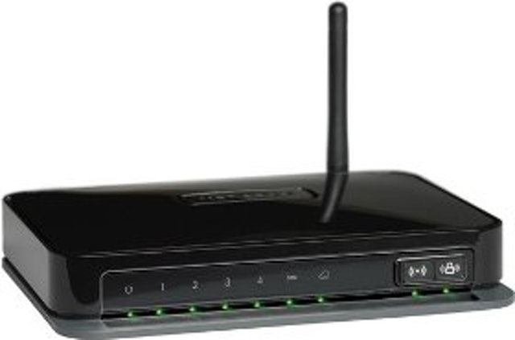
> 2. Huawei WS 330
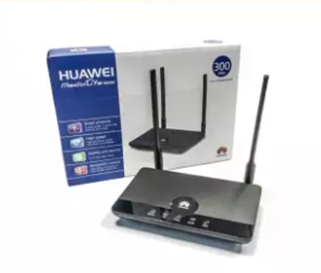

- Wirelesscard : menghubungan dua device secara nirkabel, biasanya menggunakan jaringan wifi.
* Contoh wirelesscard :
    
    - TP-Link AC1300
    
    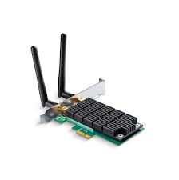
    
    - TP-Link AC1900 (Archer T9E).
    
    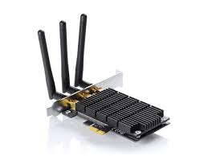

- *LAN Card* : menghubungkan dua komputer atau lebih dengan menggunakan medua kabel. Juga berfungsi mengubah aliran data yang berbentuk paralel menjadi bentuk serial, sehingga dapat ditransmisikan melalui media jaringan seperti kabel UTP.
* Contoh LAN Card :
    
    - Ubit RJ45 x 2 Gigabit LAN.

    

    - Cudy PE10 10/100/1000 Mbps

    

- *Modem* : Singkatan dari Modulator Demodulator, memiliki fungsi mengubah sinyal digital menjadi sinyal analog atau sebaliknya.

* contoh Modem :
    - NETGEAR DOCSIS 3.0 (CM400-1AZNAS)

    

    - TP-Link (TC-7610-E)

    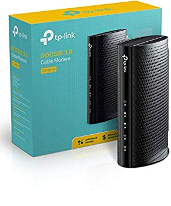

- *Bridge* : berfungsi memperluas suatu jaringan serta membuat sebuah segmen jaringan. Cara kerja bridge yaitu mengenali MAC address yang mentransmisikan sebuah data ke jaringan, kemudian bridge akan membuat tabel internal secara otomatis, dimana tabel tersebut dapat menentukan segmen mana yang akan dirouting maupun yang akan di filter.
* Contoh Bridge :
    - Linksys velop Mesh

    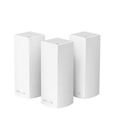

    - Netgear Universal N3000 (WNCE2001)

    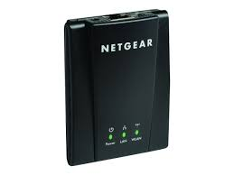

- *HUB* : berfungsi mengubah sinyal transmisi jaringan, dimana hal tersebut dimaksudkan agar kedua komputer atau lebih dapat saling terhubung. Namun HUB tidak dapat mengatur alur jalannya suatu data, sehingga setiap paket data yang melewati HUB akan dibroadcast ke semua port sampai paket data yang dimaksud sampai ke tujuan. 
* contoh HUB :
    - 
- *Switch* : Fungsinya hampir sama dengan HUB, tetapi lebih canggih, karena dapat mengatasi masalah tabrakan data (collision). Switch memiliki kecepatan transfer data dan luas jaringan yang jauh lebih bagus dari HUB.
* Contoh Switch :
    - Netgear GS108 8-Port.

    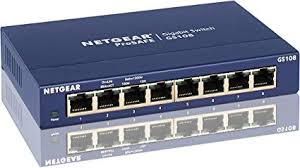

    - Netgear GS308 8-Port.

    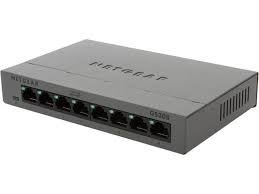

- *Kabel jaringan* : media transmisi untuk menghubungkan dua komputer atau lebih untuk saling bertukar data.
> Jenis kabel jaringan :
- Kabel UTP
> ex : Belden, Netviel
- Kabel STP
> ex : vascolink, gigabit
- Kabel Coaxial
> ex : belden, cable pro
- Kabel FO
> ex : netviel, furukawa

- *Repeater* : berfungsi memperluas jangkauan sinyal wifi dari server agar perangkat lain dapat terhubung. Cara kerja dari repeater itu sendiri adalah dengan menerima sinyal dari server, kemudian memancarkannya kembali dengan jangkauan yang lebih luas dan kuat, denagn kata lain sinyal yang lemah dapat dipancarkan kembali menjadi lebih kuat dan luas.
* contoh repeater :
    - edimax 7438 Rpn

    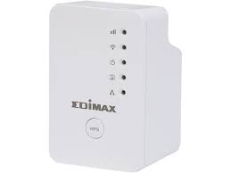

    - netgear ex 2700-100uks

    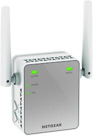

- *Access Point* : terdiri dari antenna dan transceiver yang digunakan untuk transmisi dan menerima sinyal dari client atau sebaliknya. Dengan adanya AP ini, kita dapat terhubung dengan jaringan LAN secara nirkabel. Berfungsi menghubungkan dua jenis jaringan yang berbeda, yaitu antara jaringan wireless dan jaringan LAN.
* Contoh Access point :
    - Uniquiti Unifi 802.11ac

    

    - TP-Link AC1750

    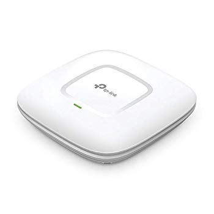

5. **OSI Layer**
* *Physical Layer* :
    - Memindahkan Bit antara Devices
    - Berkomunikasi langsung dengan jenis media transmisi.
    - Merepresentasikan bit.
    - Menentukan kebutuhan daya listrik, mekanik, prosedural dan fungsional. mempertahankan dan menonaktifkan hubungan fisik antarsistem.
    - berurusan dengan hardware

* *Datalink Layer* :
    - Mengkomunikasikan bit ke bytes dan byte ke frame.
    - Menerima perangkat medua berupa MAC Addressing.
    - Deteksi error dan recovery error.
    - Menyediakan transmisi phisik dari data.
    - Menangani notifikasi error, topologi jaringan, flow control.
    - Memastikan pesan-pesan akan terkirim melalui alat yang sesuai di LAN menggunakan hardware address (MAC).
    - Menterjemahkan dari layer network di atasnya ke bit-bit layer fisik di bawahnya.
    - Melakukan format pesan atau data menjadi pecahan-pecahan (data frame).
    - Menambahkan header yang terdiri dari alamat HW sources & destination (semacam informasi kontrol).
    - Mengidentifikasi peralatan pada network.
    - Membentuk enkapsulasi yang membungkus data asli.
    - Enkapsulasi akan dilepas setelah paket diterima oleh layer di bawahnya.
    - Enkapsulasi akan berlanjut di hop lain hingga paket sampai ke tujuan.
    - Paket tidak akan berubah sepanjang pengiriman.

* *Network Layer* :
    - Mengangkut lalu lintas antar peralatan yang tidak terhubung secara lokal.
    - Paket diterima oleh interface router.
    - Router akan mencek alamat IP tujuan.
    - Melakukan routing tabel.

* *Transport Layer* :
    - Melakukan segmentasi dan menyatukan kembali data yang tersegmentasi (reassembing) dari upper layer menjadi sebuah arus data yang sama.
    - Menyediakan layanan transportasi data ujung ke ujung.
    - Membuat sebuah koneksi logikal antara host pengirim dan tujuan pada sebuah internetwork.
    - Bertanggung jawab menyediakan mekanisme multiplexing.

* *Session Layer* :
    - Mempertahankan data dari berbagai aplikasi yang digunakan.
    - Bertanggung jawab untuk membentuk, mengelola, dan memutuskan session-session antar-layer di atasnya.
    - Kontrol dialog antar peralatan / node.
    - Koordinasi antar sistem-sistem dan menentukan tipe komuniskasinya (simplex, half duplex, full duplex).
    - Menjaga terpisahnya data dari banyak aplikasi yang menggunakan jaringan.

* *Presentation Layer* :
    - Bagaimana data dipresentasikan.
    - Menyajikan data.
    - Layanan Penterjemah.
    - Menentukan tipe data (gambar, audio, video, atau teks), enkripsi (ASCII atau EBCDIC), dan ekstensi file agar file siap ditampilkan dilayer aplikasi.

* *Application Layer* : 
    - Interface antara jaringan dan SW aplikasi.
    - Mengkomunikasikan service ke aplikasi.

* Penerapan Model **OSI layer** dalam penerimaan email. 
    - _Application Layer_ : menggunakan email client, outlook/thunderbird yang memiliki fungsi SMTP dan POP 3.
    - _Presentation layer_ : saat mengirim email dalam format HTML atau ASCII. lalu aplikasi membuat unit data yang diformat dalam HTML dan ASCII.
    - _Session Layer_ : Pesan Email Tersebut akan menggunakan Operating System untuk membuka sebuah session untuk komunikasi antar host.
    - _Transport Layer_ : Sebuah socket TCP dengan server SMTP dibuka oleh OS. Virtual Circuit dibuka antara komputer kita dengan server email dengan menggunakan TCP.
    - _Network Layer_ : Komputer mencari IP address dari SMTP server dengan melihat routing table pada OS. Jika tidak ditemukan akan diteruskan ke router perusahaan untuk menentukan jalur.
    - _Datalink Layer_ : Paket IP ditransformasikan ke fram ethernet.
    - _Physical Layer_ : Frame Ethernet dikonversikan ke sinyal - sinyal listrik yang dikirim sepanjang kabel UTP CAT 5. 

# Penerapan OSI Layer

Selain dalam computer network, osi layer dapat diterapkan dibeberapa segment, diantaranya :

1. Robotics OSI Layer
2. Car OSI Layer (Canbus)
3. Ethernet OSI Layer