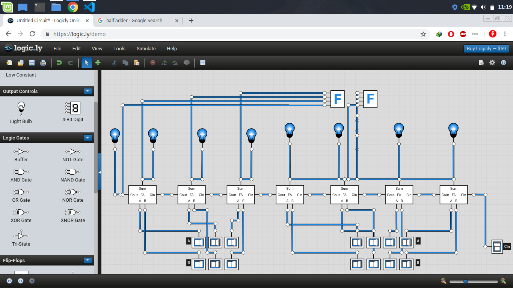

# Pertemuan 3 

## Memahami proses substracion pada kalkulator dengan metode logic gates

0. Binary
1. logic gates
2. substraction
3. addition
4. calculator
5. logic.ly
6. mine craft

## definisi pengurangan (substraction) = penambahan kondisi baru dengan maksud dan tujuan sebagai proses pengurangan.

1. metode addition for substraction
ex : A = 4
     binary = 0100
     B = 1
     binary = 0001

     condition = substraction (-)

     A - B =
     4 - 1 =    
                0100
              + 0001
              -------
                0101
              + 0001
              -------
                0110
              + 0001
              -------
                0111
              + 0001
              -------
              (1)000
              + 0001
              -------
                0001
              + 0001
              -------
                0010
              + 0001
              -------
                0011

0011 = 3 decimal

2. metode logic gates

              
