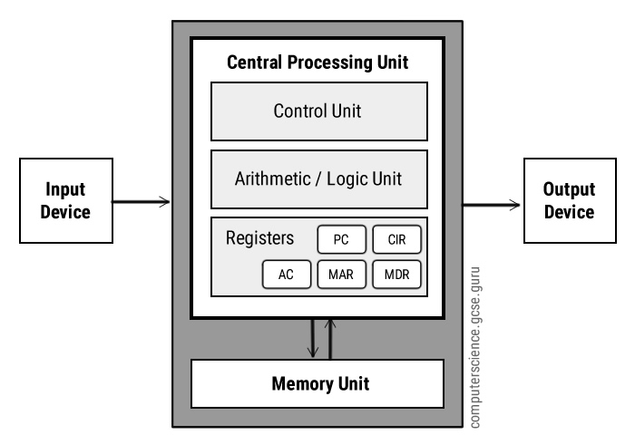

# pertemuan 5

1. _von neumann_ : pencipta arsitektur komputer princeton architecture atau yg lebih dikenal dengan von neumann model architecture berbasis matematika dan fisika.

> arsitekrur mendefinisikan bagaimana sebuah fungsi dapat bekerja dengan benar. 

- hubungan cpu dan _von neumann architecture_
  > cpu : central processing unit -> pusat pemrosesan atau circuit yg mengontrol manipulasi data.
  > fungsi cpu : mengontrol seluruh aktifitas komputer.

  > cpu terbagi atas :
        
    - ALU : Arithemtic logic unit, untuk membuat hasil dari instruksi, memilah yang salah dan benar.
    - CU : circuit yg mengkordinasi aktifitas dari cpu.
    - Register : memory penyimpanan / cadangan untuk melakukan proses lainnya pada saat bersamaan. (RAM tercepat dikomputer yang ada didalam CPU)

- Von neumann architecture
    >  <-Main Memory - ALU & CU - Input/Output->
    
    > Main Memory : tempat berlangsungnya instruksi yang harus dieksekusi di simpan pada sebuah tempat dimemory sebagai binary
    
    //setiap proses atau instruksi yang dilakukan memerlukan alokasi memory//
    
    //system clock pulse menjaga ritme kerja cpu (Hz)//
    
    //fetch-execute cycle//

    > input hardware : 
    - Mouse
    - keyboard
    > memory hardware :
    - storage
    - RAM
    > Processs :
    - ALU : menjalankan fungsi aritmatika dan matematika
    - CU : mengatur proses
    > Output :
    - Monitor
    - Printer    

## Tugas

- Pelajari

1. Cara Kerja CPU (_Central Processing Unit_)
2. Cara Kerja Computer
3. Komponen pada Computer dan fungsinya :
    - south and north bridge
    - bus 
    - SATA
    - PCIE
    - NVME
    - M2
    - dimm and sodimm
    - etc.